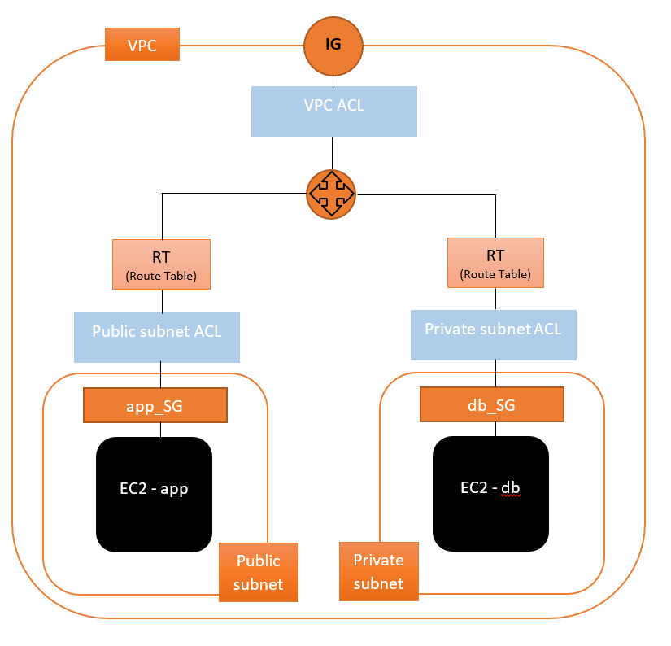

# AWS Virtual Private Cloud (VPC) & CIDR Blocks

---
#### What is a VPC?
AWS isolated virtual network - It allows us to control virtual network environment including selection of your own IPs address range, we can create multiple subnets within one VPC with specific network configuration. We can use both IPv4 & IPv6 for most resources, it provdes security for your services or instances.

## Internet Gateway
#### What is an Internet Gateway?
An Internet Gateway can transfer communications between an enterprise network and the internet. It allows internet access into the VPC.

**Write own defintition here**

## Subnets
#### What is a Subnet?
A Subnet is a segmented piece of a larger network - the goal of the subnet is to split a large network into a group of smaller, inter-connected networks to help minimise traffic - or navigate traffic securely.

**Write own defintition here**

## Route Tables
#### What is a Route Table (RT)?
RT contains a set of rules, called routes, that are used to determine where the network traffic from your subnet or gateway is directed.

**Write own defintition here**

## Network Access Control List (NACL)
#### What is a Network Access Control List (NACL)?
NACL's are stateless - we have to explicility allow inbound **AND** outbound rules. They are an added layer of security at the subnet level.

**Write own defintition here**

## Security Groups

---

## Networking Task
*4.3 Billion IP addresses in the world (approx.)*
- Step 1: create a VPC with IPV *valid* CIDR block
    
    `10.0.0.0/16`  ->  `10.101.0.0/16`  ->  `10.102.0.0/16`

- Step 2: Create internet gateway (IG)

    Step 2.1: Attach the IG to your VPC

- Step 3: Create route tables

    Step 3.1: Edit route and insert your IG in `target`

- Step 4: Create public subnet

    `10.0.1.0/24` *(Choose according to your VPC IP range)*

    Step 4.1: Associate public subnet with our RT

- Step 5: Create public NACLs

    Set inbound and outbound rules for this

- Step 6: Create a Security Group for our app

---
# Creating a custom VPC with subnets
**Diagram of what we want to create**

## Create a VPC
1. Navigate to `Your VPCs` in the dashboard and select `Create VPC`
2. Name your VPC --> *SRE_will_VPC*
3. Set an IPv4 CIDR block
    
    In my case, it is set to `10.101.0.0/16`

4. Select `Create VPC`

## Create an Internet Gateway (IG)
1. Navigate to `Internet Gateways` in the dashboard and select `Create internet gateway`
2. Name your IG --> *SRE_will_IG*
3. Find your IG in the list, select `Actions -> Attach to VPC` and select your VPC

## Create Subnets
1. Navigate to `Subnets` in the dashboard and select `Create subnet`
2. Select your VPC from the dropdown menu
3. Name your subnet --> *SRE_will_XYZ_subnet*
4. Select your preferred availability zone
5. Set an IPv4 CIDR block.

    In this case, the VPC IPv4 CIDR is set to `10.101.0.0/16`, therefore, the 1st subnet should be set to `10.101.1.0/24`

6. More than 1 subnet can be created at once within this menu. Create the number of required subnets with appropriate names and IPv4 CIDR blocks.

    *N.B. We are creating a public and a private subnet.*

## Create a Route Table (RT)
1. Navigate to `Route Tables` in the dashboard and select `Create route table`
2. Name your RT --> *SRE_will_RT*
3. Select your VPC from the dropdown menu
4. After creating the RT, select it in the list, go to the `Routes` tab and `Edit routes`
5. `Add route` with destination as `0.0.0.0/0` and target your IG (created previously)

    *Click the `Target` box and select `Internet Gateway` from the dropdown menu. After this, your IG should be shown.*

6. Select your RT in the list, go to the `Subnet associations` tab and `Edit subnet associations`. Select your subnets and `Save associations`

## Create Network Access Control List (NACL)
*Note that when creating a VPC, a default NACL will have been created. For this NACL, all inbound and outbound from other NACL's must be added.*

1. Navigate to `Network ACLs` in the dashboard and select `Create network ACL`
2. Name your NACL --> *SRE_will_XYZ_ACL*
3. Select your VPC from the dropdown menu. 

    *N.B. We will create a public and a private NACL for both our subnets*

4. Select your NACL from the list, go to the `Inbound rules` tab and edit your rules. Do the same for `Outbound rules`.

---
### Public Subnet Rules
#### Inbound Rules
| Rule | Source IP | Protocol | Port       | Allow/Deny |
|------|-----------|----------|------------|------------|
| 100  | 0.0.0.0/0 | HTTP     | 80         | ALLOW      |
| 110  | My IP     | SSH      | 22         | ALLOW      |
| 120  | 0.0.0.0/0 | TCP      | 1024-65535 | ALLOW      |
| *    | 0.0.0.0/0 | ALL      | ALL        | DENY       |

**Must replace `My IP` with your actual IP**
#### Outbound Rules
| Rule | Source IP     | Protocol | Port       | Allow/Deny |
|------|---------------|----------|------------|------------|
| 100  | 0.0.0.0/0     | HTTP     | 80         | ALLOW      |
| 110  | 10.101.1.0/24 | TCP      | 27017      | ALLOW      |
| 120  | 0.0.0.0/0     | TCP      | 1024-65535 | ALLOW      |
| *    | 0.0.0.0/0     | ALL      | ALL        | DENY       |

*N.B. `10.101.1.0/24` is the address of the public subnet. This is to allow the app machine to send a request for data from the db machine.*

### Private Subnet Rules
#### Inbound Rules
| Rule | Source IP     | Protocol | Port       | Allow/Deny |
|------|---------------|----------|------------|------------|
| 100  | 10.101.1.0/24 | TCP      | 27017      | ALLOW      |
| 110  | My IP         | SSH      | 22         | ALLOW      |
| 120  | 0.0.0.0/0     | TCP      | 1024-65535 | ALLOW      |
| *    | 0.0.0.0/0     | ALL      | ALL        | DENY       |

*Again, the public subnet address is required here. This is to allow the app machine to request data from the db machine.*

#### Outbound Rules
| Rule | Source IP | Protocol | Port       | Allow/Deny |
|------|-----------|----------|------------|------------|
| 100  | 0.0.0.0/0 | HTTP     | 80         | ALLOW      |
| 120  | 0.0.0.0/0 | TCP      | 1024-65535 | ALLOW      |
| *    | 0.0.0.0/0 | ALL      | ALL        | DENY       |

---
# Create EC2 Instances
Now that the network is setup, allowing communication between the subnets, we can initilise the app and db machines, ensuring to set them up correctly. If you don't know how to set these machines up, go to > https://github.com/Mo0rBy/creating_2Tier_architecture_AWS

**When launching your machines, select your VPC and subnets that you have created!**