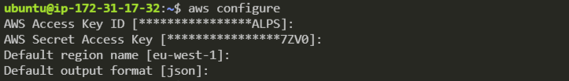

# S3 on AWS
## AWSCLI Configuration
### Installing dependencies and AWSCLI
1. Initialise and EC2 instance (similar to app) and access it on the command line
2. Update and upgrade Ubuntu on the EC2 instance
    ```
    sudo apt-get update -y
    sudo apt-get upgrade -y
    ```
3. The dependencies for AWSCLI are:
    
    - Python 3.5 or above
    - pip3
    - AWS configure set up

4. Install python
    ```
    sudo apt-get install python
    ```
    Can check what version of Python is installed using `python --version`. If the output is `Python 2.7.12`, then run the command `alias python=python3`. Run the version check command again and it should output `Python 3.5.2`.
5. Install pip3
    ```
    sudo apt-get install python3-pip
    ```
6. Install AWSCLI
    ```
    python3 -m pip install awscli
    ```

### Configuring AWSCLI
Now that AWSCLI is installed, we can configure it using the command `aws configure`. This will prompt you for your AWS Access key, Secret key, default region (eu-west-1) and output format (json).



## Using S3
With AWSCLI configured, we can now access a list of all the S3 buckets on the system using the command `aws s3 ls`.

### Creating a new S3 bucket
To create an S3 bucket > `aws s3 mb s3://srewill`

*`mb` mean "make bucket"*

### Adding a file to your bucket
Create a file on your EC2 instance (can be created anywhere)

To copy this file to the new bucket > `aws s3 cp <filepath> s3://srewill/`

*The filepath can be relative if you are in the correct directory, otherwise the filepath must be absolute.*

### Copying a file from your bucket
To copy a file from your bucket > `aws s3 cp s3://srewill/README.md <targetlocation>` *(Can use a `.` for the target location to copy the file to where you currently are)*

### Updating the bucket
Updating is similar to pushing to Github. It will copy the directory and update/overwrite any files that already exist on the bucket.

To update the bucket > `aws s3 sync <filepath> s3://srewill/`

### Deleting a bucket
To delete an entire bucket and all the data on it > `aws s3 rb s3://srewill --force`

## Using boto3
Using boto3 allows us to execute these commands in a Python script.
### Creating a new S3 bucket
```
import boto3
s3 = boto3.resource('s3')
bucket = s3.Bucket('srewill')
```
### Adding a file to your bucket
```
import boto3
s3 = boto3.resource('s3')
s3.meta.client.upload_file(<Filename>, <Bucketname>, <Key>)
```
### Copying a file from your bucket
```
import boto3
import botocore
s3.Bucket(<Bucketname>).download_file(<Bucketfilename>, <Localfilename>)
```
### Updating the bucket

### Deleting a bucket
In order to delete a bucket, all the keys in within the bucket must be deleted already.
```
for key in bucket.objects.all()
    key.delete()
bucket.delete()
```